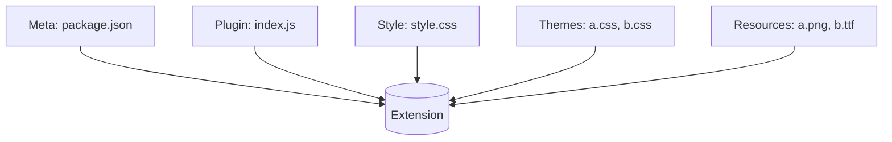

# Yank Note Extension

English | [简体中文](./README_ZH-CN.md)

Yank Note supports "**JavaScript plugins**" and "**custom CSS styles**". If you want to share your own plugins and styles with others, you can package them into an **extension** for distribution.

## Extension Structure

An extension is composed of basic information, JavaScript plugins, CSS styles, and resources, and is distributed in the form of an NPM package.



For plugin development, you can refer to the [Plugin Development Guide](https://github.com/purocean/yn/blob/develop/help/PLUGIN.md), for custom styles, you can refer to [Custom Styles](https://github.com/purocean/yn/blob/develop/help/FEATURES.md#custom-styles), and the rules for writing metadata are in the following sections of this document.

There is an [example extension repository](https://github.com/purocean/yank-note-extension-example) that can be used as a reference for the whole process.

### Basic Information

Please include `README.md` and `CHANGELOG.md` files in the root directory of the extension package for display to users in the extension management.

The extension information is saved in `package.json`.

The fields in `package.json` can refer to [package.json | npm Docs](https://docs.npmjs.com/cli/v8/configuring-npm/package-json#homepage), where the `name`, `version`, `description`, `homepage`, `author`, `license` fields are required.

In addition to the above fields, you may also need to define the following fields:

| Field | Type | Description | Example |
| -- | -- | -- | -- |
| `displayName` | *Required* `string` | Display name | `Hello World` |
| `icon` | *Required* `string` | Icon | `./icon.png` |
| `engines` | *Required* `{ 'yank-note': string }` | Compatible Yank Note version range | `{"node": ">=14.6.0", "yank-note": "^3.30.0"}` |
| `main` | *Optional* `string` | JavaScript plugin file | `./dist/index.js` |
| `style` | *Optional* `string` | CSS style file | `./dist/style.css` |
| `themes` | *Optional* `Array<{ name: string, css: string }>` | Theme style files. | `[{"name": "Red", "css": "./themes/demo1.css"}]` |

**Internationalization**

If you want to support multiple languages for the `displayName` and `description` fields, you can define multiple ones in the form of `<key>_<LANGUAGE>`. LANGUAGE should be in uppercase.

```json
{
    "displayName": "HelloWorld",
    "displayName_EN": "HelloWorld",
    "displayName_ZH-CN": "你好世界",
    "description": "hello world!",
    "description_ZH-CN": "你好世界！"
}
```

[Example `package.json` file](https://github.com/purocean/yank-note-extension-example/blob/main/package.json)

### JavaScript Plugins

The JavaScript entry file is defined in the `main` field of `package.json`.

Since plugins run in the browser, they do not support `require` or `import` syntax and need to be packaged in advance.

### Style Files

- Define the plugin style file in the `style` of `package.json`, and load it with the plugin.
- Define the theme style file in the `themes` of `package.json`, and users can select and use it in the "Settings".

### Static Files Directory

The [Yank Note Extension Directory] will be added to the application's static file search directory.

When using static resources, pay attention to whether the path is correctly concatenated. You can use relative paths or call the [`getExtensionBasePath`](https://github.com/purocean/yank-note-extension/blob/ef321713d4f24318dd3ad657af723325b426edb6/packages/api/src/index.ts#L24) method to get the path.

## Developing Extensions

When developing a plugin, it is recommended to open Yank Note in the Chrome browser for easy debugging. To open it: right-click the tray icon --> click "Open in browser"

1. Use the [scaffold](https://github.com/purocean/yank-note-extension/tree/main/packages/create-extension) to create a project: `yarn create yank-note-extension`. It is suggested to start the package name with `yank-note-extension-`.
2. After entering the project, install dependencies: `yarn install`
3. Link the current directory to the [Yank Note Extension Directory]: `yarn run link-extension`
4. Start development: `yarn run dev`
5. Refresh the browser page
6. Click "Tools" --> "Extension Center" to enable the extension under development

Now you should be able to see the "Hello World" menu in the "status bar" menu.

## Distributing Extensions

After you have finished developing, if you want to make the extension available for others to use, there are two ways:

1. Manual distribution: Inform users of the download method and installation steps. Users place the extension in the [Yank Note Extension Directory], and then enable it in the extension management panel.
2. Use the Yank Note Extension Registry for distribution, where users can download/upgrade directly from the extension management panel. Please visit [yank-note-registry](https://github.com/purocean/yank-note-registry) for more information.

[Yank Note Extension Directory]: https://github.com/purocean/yn/blob/develop/help/FEATURES.md#data-storage
