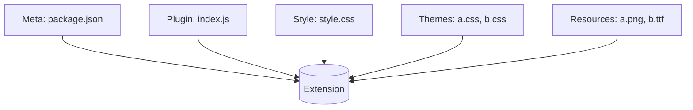

# Yank Note 扩展

Yank Note 支持 “**JavaScript 插件**” 和 “**自定义 CSS 样式**” 功能。如果你想将自己编写的插件和样式分享给其他人使用，那么你可以将它们制作成**扩展**的形式分享出去。

## 扩展结构

扩展是由基础信息、JavaScript 插件、Css 样式和资源组合在一起构成，使用 NPM 包的形式进行分发。



插件相关开发可参考[插件开发指南](https://github.com/purocean/yn/blob/develop/help/PLUGIN.md)，自定义样式可以参考[自定义样式](https://github.com/purocean/yn/blob/develop/help/FEATURES.md#custom-styles)，元信息编写规则参考本文后面的章节。

这里有一个[扩展示例仓库](https://github.com/purocean/yank-note-extension-example)，可以作为整体参考。

### 基础信息

扩展包根目录下请包含 `README.md` 和 `CHANGELOG.md` 文件，方便在扩展管理中对用户展示。

扩展的信息保存在 `package.json` 中。

`package.json` 中字段可以参考 [package.json | npm Docs](https://docs.npmjs.com/cli/v8/configuring-npm/package-json#homepage)，其中 `name`, `version`, `description`, `homepage`, `author`, `license` 字段是必须的。

除了上述字段外，你可能还需要额外定义如下字段：

| 字段 | 类型 | 说明 | 示例 |
| -- | -- | -- | -- |
| `displayName` | *必须* `string` | 显示名 | `Hello World` |
| `icon` | *必须* `string` | 图标 | `./icon.png` |
| `engines` | *必须* `{ 'yank-note': string }` | 兼容的 Yank Note 版本范围 | `{"node": ">=14.6.0", "yank-note": "^3.30.0"}` |
| `main` | *可选* `string` | JavasScript 插件文件 | `./dist/index.js` |
| `style` | *可选* `string` | CSS 样式文件 | `./dist/style.css` |
| `themes` | *可选* `Array<{ name: string, css: string }>` | 主题样式文件。 | `[{"name": "Red", "css": "./themes/demo1.css"}]` |


**国际化**

如果要使 `displayName` 和 `description` 字段支持多语言，可以使用 `<key>_<LANGUAGE>` 形式定义多个。LANGUAGE 需要大写。

```json
{
    "displayName": "HelloWorld",
    "displayName_EN": "HelloWorld",
    "displayName_ZH-CN": "你好世界",
    "description": "hello world!"
    "description_ZH-CN": "你好世界！",
}
```

[示例 `package.json` 文件](https://github.com/purocean/yank-note-extension-example/blob/main/package.json)

### JavaScript 插件

JavaScript 入口文件在 `package.json` 中的 `main` 字段中定义。

因为插件是在浏览器中运行，所以不支持 `require` 或 `import` 语法，需要提前打包好。

### 样式文件

- 在 `package.json` 中的 `style` 中定义插件样式文件，和插件一并加载。
- 在 `package.json` 中的 `themes` 中定义主题样式文件，用户在“设置”中选取使用。

### 静态文件目录

[Yank Note 扩展目录] 会加入应用静态文件查找目录。

使用静态资源时候需要注意需要路径是否拼接正确。可以使用相对路径或调用 [`getExtensionBasePath`](https://github.com/purocean/yank-note-extension/blob/ef321713d4f24318dd3ad657af723325b426edb6/packages/api/src/index.ts#L24) 方法获取路径。

## 开发扩展

开发插件时候建议在 Chrome 浏览器中打开 Yank Note，方便调试。打开方法：右键点击托盘图标 --> 点击“浏览器中打开”

1. 使用[脚手架](https://github.com/purocean/yank-note-extension/tree/main/packages/create-extension)创建项目: `yarn create yank-note-extension`。包名建议以`yank-note-extension-` 开头。
2. 进入项目后，安装依赖: `yarn install`
3. 链接当前目录到 [Yank Note 扩展目录]: `yarn run link-extension`
4. 启动开发: `yarn run dev`
5. 刷新浏览器页面
6. 点击“工具” --> “扩展中心”，启用开发中的扩展

现在你应该能在“状态栏”菜单中看到“你好世界”的菜单了。

## 分发扩展

当你开发完成后，如果你想要将扩展给别人使用，有两种方式：

1. 手动分发：告知用户下载方式及安装步骤。用户将扩展放置到[Yank Note 扩展目录]中，然后在扩展管理面板里面启用。
2. 使用 Yank Note 扩展注册中心分发，用户可以直接在扩展管理面板中下载/升级。请访问 [yank-note-registry](https://github.com/purocean/yank-note-registry) 了解更多。


[Yank Note 扩展目录]: https://github.com/purocean/yn/blob/develop/help/FEATURES.md#data-storage
