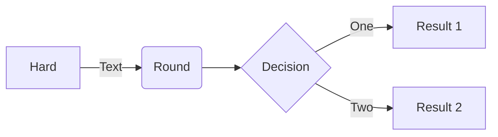

# Mermaid Extension

This extension integrates [Mermaid](https://github.com/mermaid-js/mermaid) into Yank Note.

## Usage

~~~markdown

```mermaid
graph LR
A[Hard] -->|Text| B(Round)
B --> C{Decision}
C -->|One| D[Result 1]
C -->|Two| E[Result 2]
```
~~~

## Screenshots

