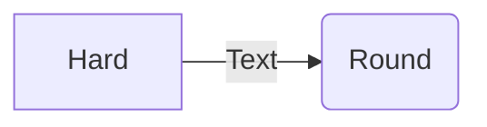

# Reveal.js

This extension integrates [Reveal.js](https://revealjs.com/) into Yank Note.

## Screenshots


## Usage

~~~markdown
---
defaultPreviewer: 'Reveal.js'
revealJsOpts: {
    theme: 'moon', # theme https://revealjs.com/themes/
    progress: true, # options https://revealjs.com/config/
    center: true,
}
---

::: section
## Slide 1 {style="color:red"}

```js
await new Promise(r => setTimeout(r, 500))
ctx.ui.useToast().show("info", "HELLOWORLD!")
console.log("hello world!")
```
:::

::: section
## Horizontal Slide

$$
\nabla \cdot \vec{\mathbf{B}}  = 0
$$
:::

::::: section
### Vertical Slide

::: section
### Vertical Slide 1

+ Subject{.mindmap}
    + Topic 1
    + Topic 2
    + Topic 3
    + Topic 4

:::
::: section
### Vertical Slide 2



:::
::: section
### Vertical Slide 3

@startuml
a -> b
@enduml

:::
:::::
~~~

Click "Tool" -> "Present with Reveal.js " in the status bar.

点击状态栏的菜单：“工具” -> “使用 Reveal.js 演示”。
